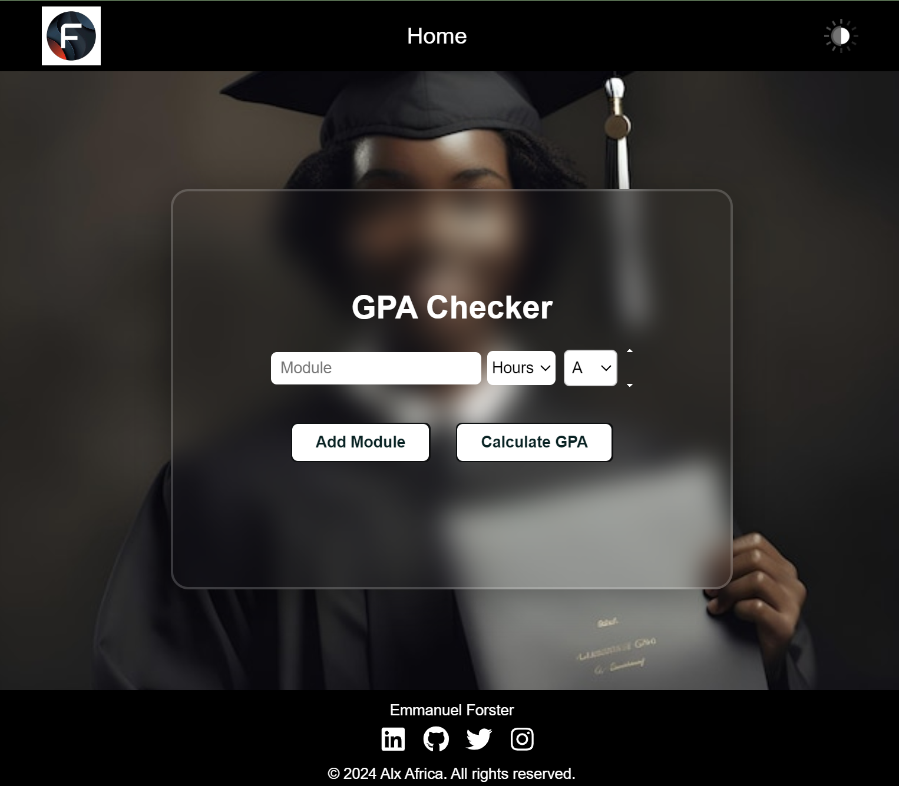
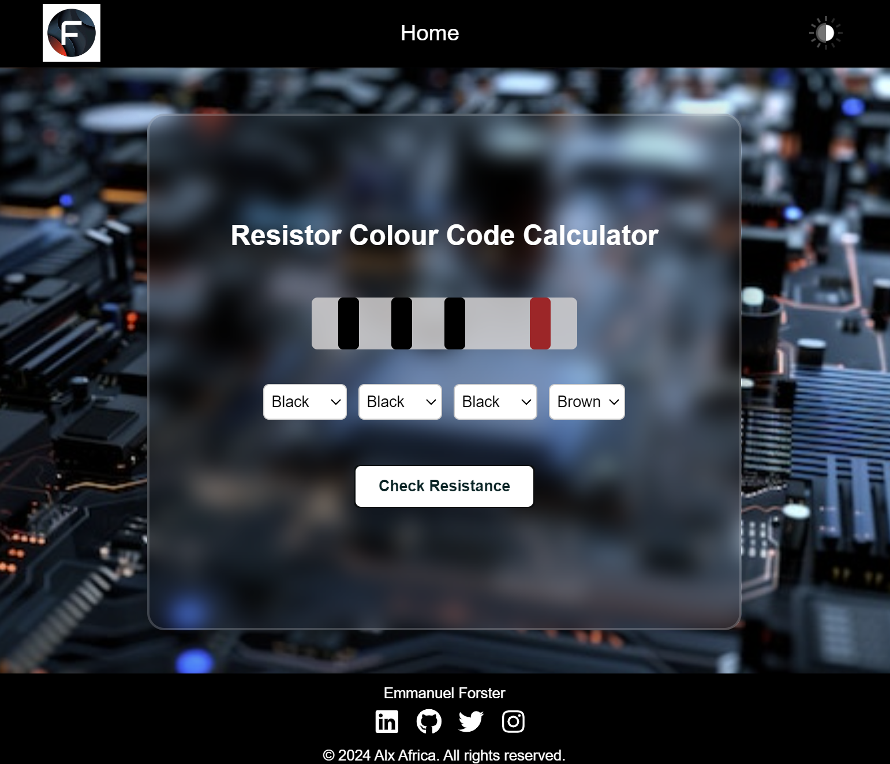
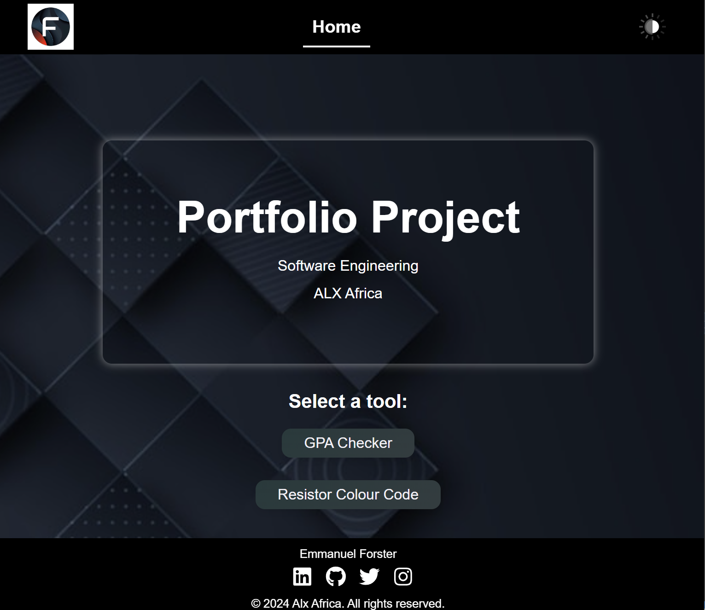

# Emmanuel's Portfolio Project

Welcome to my portfolio project! This web application showcases a toolkit with two essential tools: a GPA Calculator and a Resistor Color Code Generator. It's designed to be user-friendly and visually appealing.

## Features

- **GPA Calculator**: Calculate your GPA by entering your courses, grades, and credit hours. The tool supports a wide range of grades and provides instant results.
- **Resistor Color Code Generator**: Select resistor band colors to get the calculated resistance value. This tool simplifies the process of determining resistor values for circuit design.

## Live Demo

You can view the live deployed version of the application [here](https://emmie05.github.io/Portfolio-Project/).

## Screenshots





## Getting Started

To get a local copy of the project up and running, follow these steps:

1. **Clone the Repository**

    ```bash
    git clone https://github.com/Emmie05/portfolio-project.git
    ```

2. **Navigate to the Project Directory**

    ```bash
    cd portfolio-project
    ```

3. **Open `index.html`**

    You can open `index.html` in your web browser to view the project.

## Technologies Used

- **HTML**: Markup language for structuring the web pages.
- **CSS**: Stylesheet language for designing the layout and appearance.
- **JavaScript**: Programming language for adding interactivity.
- **Font Awesome**: Icon library for social media icons.
- **Google Fonts**: Custom fonts for a modern look.

## Contributing

If you'd like to contribute to this project, please fork the repository and create a pull request with your changes. All contributions are welcome!

## License

This project is licensed under the MIT License - see the [LICENSE](LICENSE) file for details.

## Contact

If you have any questions or feedback, feel free to reach out to me:

- **GitHub**: [Emmie05](https://github.com/Emmie05)
- **LinkedIn**: [Emmanuel Forster](https://linkedin.com/in/emmanuel-forster-3ab072296)
- **Twitter**: [EmmForster](https://twitter.com/EmmForster)

Thank you for checking out my project!
